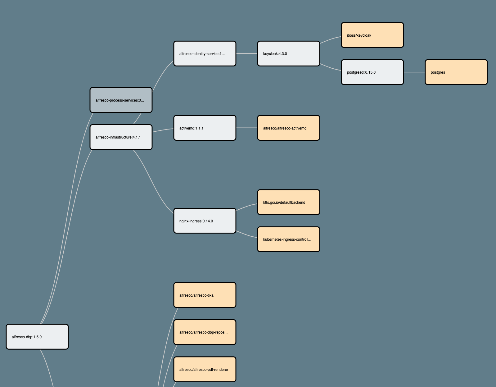
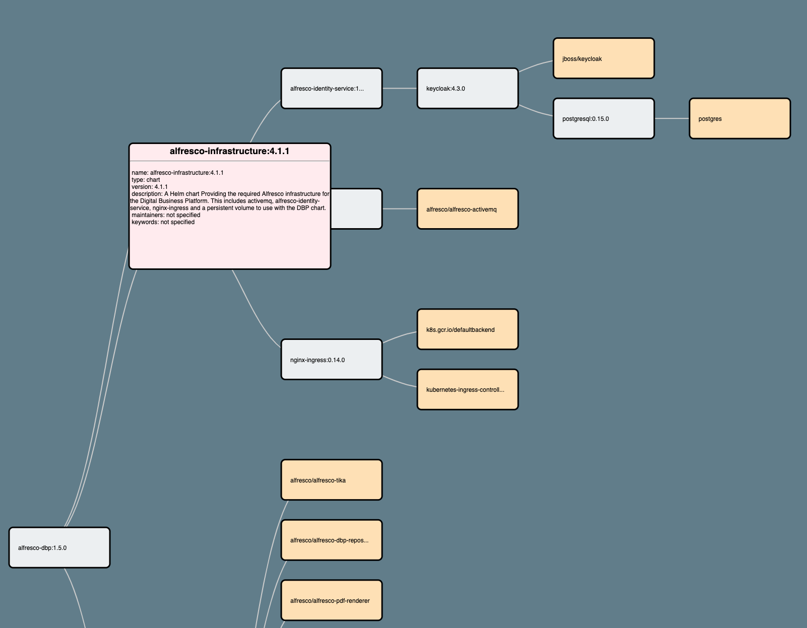

# helm-inspector

Try it out &#8594; [https://melahn.github.io/helm-inspector/src](https://melahn.github.io/helm-inspector/src) 

### Overview
This project provides an interactive tree view of a Kubernetes Helm chart and its dependencies.

The tree view is loaded from a file containing a JSON representation of a Helm chart,
such as can be generated from
https://github.com/Alfresco/alfresco-anaxes-chartmap, though any properly formed JSON 
representation will work. See [JSON Model](#json-model)

The tree view is created using [D3](https://d3js.org/) Version 5.

### Usage

#### Chart Selection

To select the Helm chart the inspector accepts one optional URL parameter,*chart*, that allows you to specify the name of
the json file to load with the helm data.  If that parameter is not found it looks for the file *./helm-data.json*.
For example you can use this url to inspect a
helm chart called *alfresco-identity-service-2.0.0*.

[https://melahn.github.io/helm-inspector/src?chart=examples/alfresco-identity-service-2.0.0](https://melahn.github.io/helm-inspector/src?chart=examples/alfresco-identity-service-2.0.0)

There are other example json files in the [Examples Folder](./src/examples)

#### A Little More Help

There two interaction modes:
* *navigate*:  Clicking on an unexpanded tree node expands the node to see the children.
Clicking on an expanded node collapses the node, hiding the children.  When a node has 
child nodes that are not visible, the node is colored darker to indicate that fact.
* *inspect*: Hovering over a node with the mouse shows details of that node.

The current mode is always shown in a message near the top of the page. You start out in *navigate* mode.  

You can switch the mode using either the mouse or the keyboard, as follows:

Using the mouse: 
* Double-clicking will switch to the other mode.

Using the keyboard:
* Pressing the 'i' key puts you in *inspect* mode.  
* Pressing the 'n' key puts you back in *navigate* mode.

#### Navigate Mode Example

#### Inspect Mode Example

*Note*: You can generate different 'helm-data.json' files using https://github.com/Alfresco/alfresco-anaxes-chartmap
or create one any way you want as long as the file conforms to the [JSON Model](#json-model).

#### JSON Model

The helm data file contains a single JSON object representing the helm tree.  

Each JSON element with properties represents a Helm chart or a Docker images used by a chart.

Each JSON element that represents a chart or an image must have a 'name' property which is
the full name of the chart or image including a version if applicable.

Each JSON element that represents a chart or an image must have a 'type' property which has a value
of 'chart' or 'image', denoting the type of element.

Each JSON element that represents a chart or an image must have a 'children' property containing 
an array of the child elements of that chart or image, if any.  If there are no child elements, then
the array should be empty, but it still must be present.

### Hosting it yourself
To host helm inspector yourself, just download the two files [index.html](./src/index.html)
and [helm-data.json](./src/helm-data.json) and serve them in a web server.  

*Note*:  You actually don't even
need the *helm-data.json* file if you provide your own data files and use the *chart* URL parameter to
select which one to use.

*Note*: It is necessary to host the files in a web server because D3 fetches the data using http(s).
You can easily start a local webserver 
using, for example, 'python -m SimpleHTTPServer' to serve local files
and then access the 'index.html' file from your browser using localhost.

### Credits 
The clickable tree view was inspired by [https://bl.ocks.org/d3noob/1a96af738c89b88723eb63456beb6510](https://bl.ocks.org/d3noob/1a96af738c89b88723eb63456beb6510)
which was in turn inspired by the collapsible-tree example in [https://observablehq.com](https://observablehq.com).

### License
MIT
